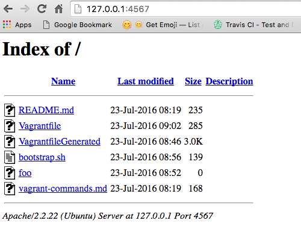
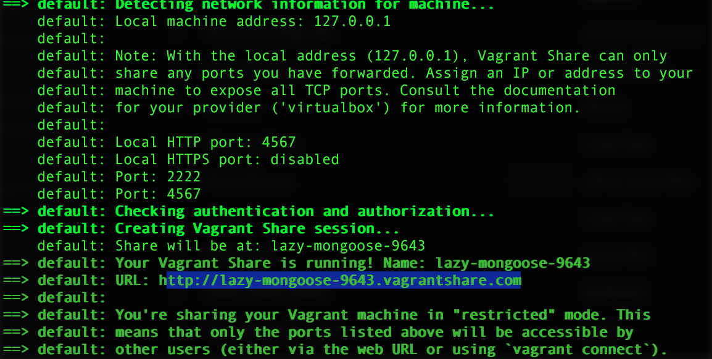
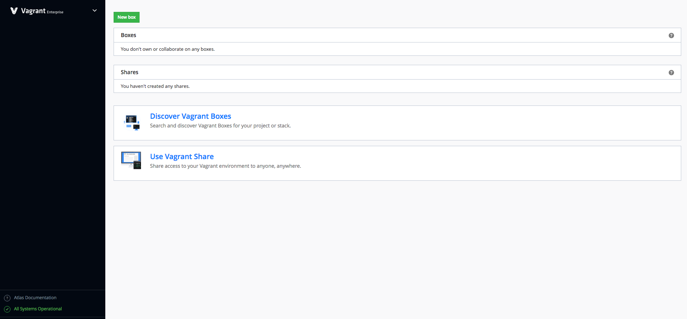
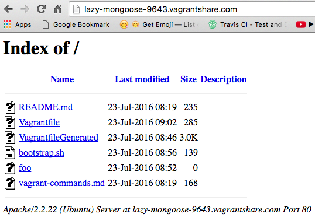

# Vagrant Getting Started Guide

A run through of the Vagrant getting started guide/tutorial. Vagrant allows setting up an isolated developer environment very easily.

No more of the common "it works on my machine" developer problems.


### Project Setup
```
vagrant init
```
this will create a Vagrantfile 

### Add Vagrant Box
```
vagrant box add hashicorp/precise64
```

### Fire Up environmnet
```
vagrant up
```
above command is the most popular/used command!

### SSH onto the environment
```
vagrant ssh
```

### Teardown
```
vagrant suspend
```
to temporary suspend it and resume it with:

```
vagrant resume
```

or halt it
```
vagrant halt
```

once finished can completely get rid of it
```
vagrant destroy
```

### Automated Provisioning

Vagrant will automatically install software configured in a provisioning shell script on VM bootup.

When changing Vagrantfile you can then use reload to reload the configuration

```
vagrant reload
```

or to tell Vagrant to provision it again

```
vagrant provision
```

### Network Options - Port Forwarding
```
config.vm.network :forwarded_port, guest: 80, host: 4567
```
telling to forward onto VM guest machine port from host machine port

other network options include:
- assign a static IP address to the guest machine
- to bridge the guest machine onto an existing network
- etc...

### Sample Configuration

```
Vagrant.configure("2") do |config|
  config.vm.box = "hashicorp/precise64"
  config.vm.provision :shell, path: "bootstrap.sh"
  config.vm.network :forwarded_port, guest: 80, host: 4567
end
```

Shell script used for provisioning 
```
#!/usr/bin/env bash

apt-get update
apt-get install -y apache2

if ! [ -L /var/www ]; then
  rm -rf /var/www
  ln -fs /vagrant /var/www
fi
```
above script installs Apache Web Server

now, you can browse to http://127.0.0.1:4567



### Vagrant Share

Sharing your Vagrant environment

Vagrant share setting up when running vagrant share command


The Vagrant Share website:



Browse to the shared vagrant URL link on browser:




